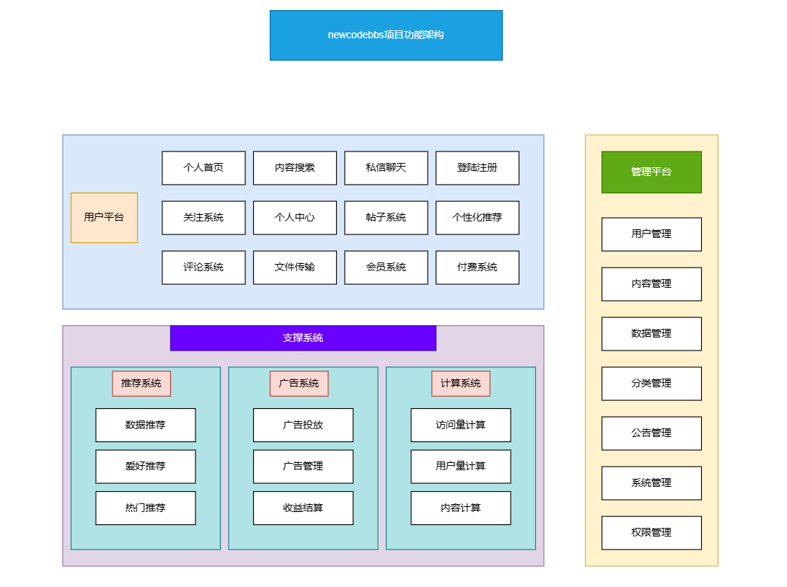

# 目录
* <a href="#newcodebbs简介">newcodebbs简介</a>
* <a href="#使用技术栈">使用技术栈</a>
* <a href="#运行项目">运行项目</a>
* <a href="#生产环境要求">生产环境要求</a>
* <a href="#接口文档">接口文档</a>
* <a href="#生产环境要求">本项目功能架构图</a>

# newcodebbs简介
newcodebbs论坛是 newcodeteam 系列的产品 
NewCodeBBS （新代码论坛）是一个集在线聊天，传统论坛，教程网，轻量购物网合一的综合大型论坛 
基于Java开发的大型单体项目，并且基于 Apache-2.0 license 协议共享，是一个可以商业化运营还能二次开发的论坛项目。 
由shanhe(山河)以及iHai共同开发 

## 使用技术栈
本项目基于Java开发，采用前后端分离模式。 
后端使用：SpringBoot + Mybatis-plus + Mysql + Redis  
第三方库:lombok + Swagger + Hutool + captcha-plus + JWT  
前端使用：Vue + 饿了么UI

## 运行项目
idea 打开 pom.xml文件 
然后在`src/main/resources`目录里面找到 `newcode_bbs.sql` 文件，将sql导入进数据库， 
并在`src/main/resources`里的`application.properties`文件中设置Mysql以及redis的账号密码 
最后等待加载完依赖即可运行。

## 生产环境要求
1. Mysql 5.7 以上
2. Redis 7 + 
3. JDK 11 以上
4. Tomcat 8 - 9 
 
最好使用docker 进行配置 ，后续也会推出docker环境包

## 接口文档
运行项目之后，然后打开 
`localhost:8080/doc.html`

# 本项目功能架构图
